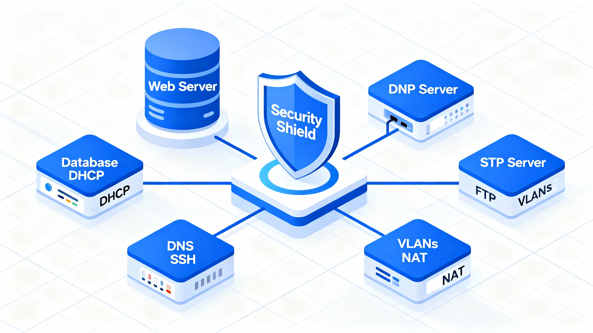

# Descripción del Proyecto

El proyecto consiste en la implantación de una infraestructura multicapa moderna y robusta que integra una variedad de servicios fundamentales para la operación eficiente y segura de una red corporativa.

Entre los servicios implementados destacan:

- **Servidor Web (Apache con PHP):** Hospedaje de una aplicación web que permite la gestión y visualización de datos críticos de la red mediante interfaces intuitivas.
- **Base de Datos MySQL:** Almacenamiento estructurado y seguro de la información, facilitando consultas optimizadas y la integridad de los datos.
- **Servicios DHCP y DNS:** Asignación dinámica de direcciones IP y resolución de nombres internos para facilitar la comunicación en la red.
- **SSH y FTP:** Canales seguros para administración remota y transferencia de archivos entre dispositivos.

Para garantizar la seguridad y segmentación adecuada, los routers están configurados con VLANs y NAT, separando las diferentes redes (DMZ, Intranet) y minimizando el riesgo de accesos no autorizados.

La aplicación web, desarrollada en PHP, interactúa eficientemente con la base de datos para mostrar en tiempo real la información almacenada, facilitando la administración y supervisión del sistema desde distintas zonas de la red.

---

*Figura: Representación visual de la infraestructura multicapa desplegada, mostrando la interconexión entre servicios y segmentos de red.*

---

## Navegación

[⬅️ Página Anterior](./introduccionadmin.md) | [Siguiente Página ➡️](./arquitecturaadmin.md)
