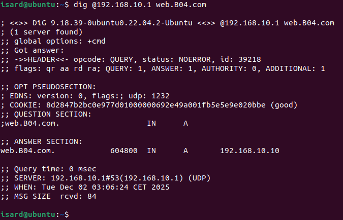

# Ver la base de datos

---
Lo primero es comprobar que tiene conexion con el servidor
```bash
ping 192.168..150
```
Ir al navegador y poner en el buscador

http://192.168.50.1

Nos tendrias que salir 

