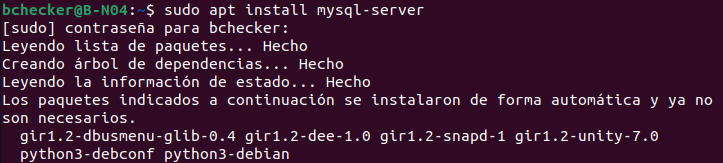
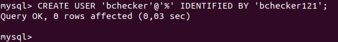
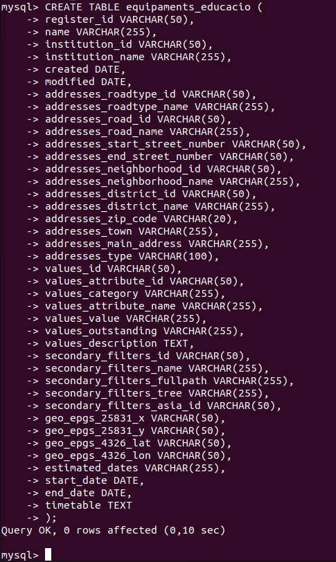
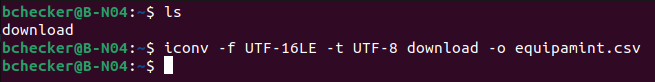
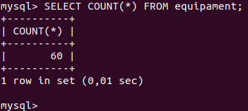

# Instalación y Configuración sel servidor B-N04 (BBDD)

Instalaremos el MySQL para poder tener nuestra BBDD y le assignaremos el usuario bchecker

Instalacion del mysql 
---
```bash
sudo apt install mysql-server -y
```


---
Nos meteremos al mysql con root y crearemos el usuario

---
```bash
sudo mysql -u root
```
```bash
CREATE USER 'bchecker'@'%' IDENTIFIED BY 'bchecker121';
```


---
Por si quieres comprobar los usuarios creados en mysql

---
```bash
SELECT user,host FROM mysql.user;
```
---
Cracion de la base de datos 

```bash
CREATE DATABASE B_N04;
GRANT ALL PRIVILEGES ON B_N04.* TO 'bchecker'@'%';
FLUSH PRIVILEGES;
```
```bash
USE B_N04
```
```bash
CREATE TABLE equipament (
register_id VARCHAR(50),
name VARCHAR(255),
institution_id VARCHAR(50),
institution_name VARCHAR(255),
created DATE,
modified DATE,
addresses_roadtype_id VARCHAR(50),
addresses_roadtype_name VARCHAR(255),
addresses_road_id VARCHAR(50),
addresses_road_name VARCHAR(255),
addresses_start_street_number VARCHAR(50),
addresses_end_street_number VARCHAR(50),
addresses_neighborhood_id VARCHAR(50),
addresses_neighborhood_name VARCHAR(255),
addresses_district_id VARCHAR(50),
addresses_district_name VARCHAR(255),
addresses_zip_code VARCHAR(20),
addresses_town VARCHAR(255),
addresses_main_address VARCHAR(255),
addresses_type VARCHAR(100),
values_id VARCHAR(50),
values_attribute_id VARCHAR(50),
values_category VARCHAR(255),
values_attribute_name VARCHAR(255),
values_value VARCHAR(255),
values_outstanding VARCHAR(255),
values_description TEXT,
secondary_filters_id VARCHAR(50),
secondary_filters_name VARCHAR(255),
secondary_filters_fullpath VARCHAR(255),
secondary_filters_tree VARCHAR(255),
secondary_filters_asia_id VARCHAR(50),
geo_epgs_25831_x VARCHAR(50),
geo_epgs_25831_y VARCHAR(50),
geo_epgs_4326_lat VARCHAR(50),
geo_epgs_4326_lon VARCHAR(50),
estimated_dates VARCHAR(255),
start_date DATE,
end_date DATE,
timetable TEXT
);
```


Instalamos el CSV el qual queremos añadir en la BBDD 

---
```bash
sudo wget https://opendata-ajuntament.barcelona.cat/data/dataset/f36b60f2-9541-4d08-b0f9-b0a9313fab3d/resource/29d9ff10-6892-4f16-9012-d5c4997857e7/download
```

```bash
iconv -f UTF-16LE -t UTF-8 opendatabcn_llista-equipaments_educacio-csv.csv -o equipament.csv
```


```bash
LOAD DATA LOCAL INFILE '/home/bchecker/equipament.csv'
INTO TABLE equipament
FIELDS TERMINATED BY ',' ENCLOSED BY '"'
LINES TERMINATED BY '\n'
IGNORE 1 LINES;
```
Comprobamos que se haya importado el archivo CSV en la tabla que creamos anteriormente en la BBDD
```bash
SELECT COUNT(*) FROM equipament;
```


---
<div align="left"><a href="./comandos_apache.md">Página anterior</a></div>
