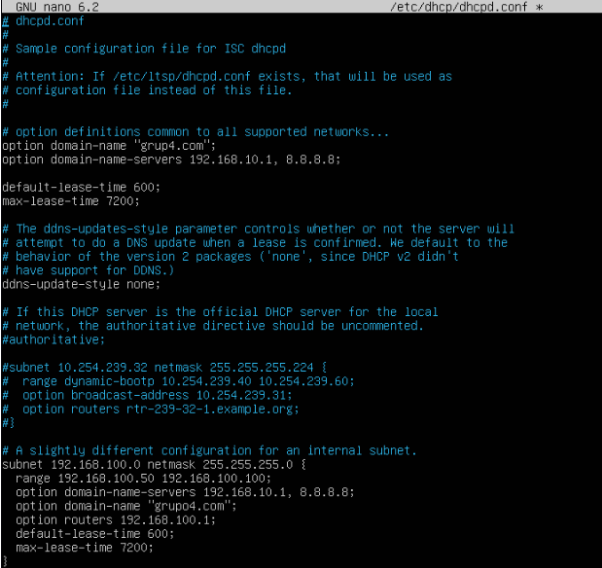
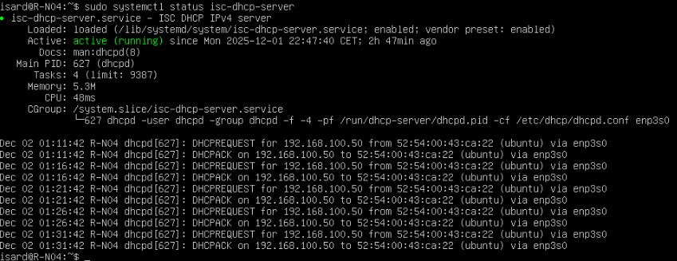

# Instalación y Configuración del DHCP

Intalamos el servicio DHCP
---
``` bash
sudo apt install isc-dhcp-server -y
```
---

Modificamos el archivo /eetc/dhcp/dhcpd.conf 
---
```bash
sudo nano /etc/dhcp/dhcpd.conf
```

```bash
# option definitions common to all supported networks...
option domain-name "grup4.com";
option domain-name-servers 192.168.10.1, 8.8.8.8;
```
```bash
subnet 192.168.100.0 netmask 255.255.255.0 {
  range 192.168.100.50 192.168.100.100;
  option domain-name-servers 192.168.10.1, 8.8.8.8;
  option domain-name "grupo4.com";
  option routers 192.168.100.1;
  default-lease-time 600;
  max-lease-time 7200;
}
```


Luego configuraremos la interfaz de red del DHCP

```bash
sudo nano /etc/default/isc-dhcp-server
```
```bash
#       Separate multiple interfaces with spaces, e.g. "eth0 eth1".
INTERFACESv4="enp3s0"
INTERFACESv6=""
```
---


Luego reiniciamos el DHCP para poder aplicar la configuración

```bash
sudo systemctl restart isc-dhcp-server
```

Luego habilitaremos y verificaremos el estado

---
<div align="left"><a href="./creacion_usuarios.md">Página anterior</a></div>
<div align="right"><a href="./comandos_ftp.md">Siguiente página</a></div>
