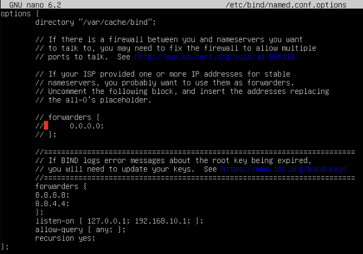
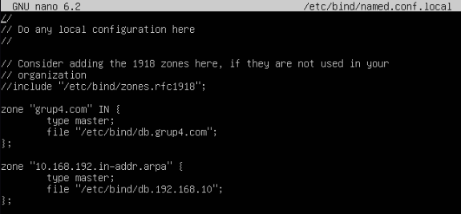

# Instalación y Configuración del DNS

```bash
sudo apt install bind9 bind9utils bin9-doc  -y
```

Definimos los forwarders externos
```bash
sudo nano /etc/bind/named.conf.local
```
```bash
        forwarders {
        8.8.8.8;
        8.8.4.4;
        };
        listen-on { 127.0.0.1; 192.168.10.1; };
        allow-query { any; };
        recursion yes;
```

Declaramos las zonas en /etc/bind/named.conf.local

```bash
zone "grup4.com" IN {
        type master;
        file "/etc/bind/db.grup4.com";
};

zone "10.168.192.in-addr.arpa" {
        type master;
        file "/etc/bind/db.192.168.10";
};
```


Copiaremos el archivo db.local y le pondremos el nombre db.ncc.local para luego modificarlo
```bash
sudo cp /etc/bind/db.local /etc/bind/db.B04.local
```
```bash
sudo nano /etc/bind/db.B04.local
```
Lo modificaremos de esta forma
```bash
$TTL    604800
@       IN      SOA     ns1.grup4.com. admin.grup4.com. (
                            3           ; Serial
                            604800      ; Refresh
                            86400       ; Retry
                            2419200     ; Expire
                            604800 )    ; Negative Cache TTL

; Servidor DNS
@       IN      NS      ns1.grup4.com.
ns1     IN      A       192.168.10.1

; Entradas de hosts
router  IN      A       192.168.10.1
web     IN      A       192.168.10.10

```
---
<div align="left"><a href="./comandos_DHCP.md">Página anterior</a></div>
<div align="right"><a href="./comandos_ftp.md">Siguiente página</a></div>
