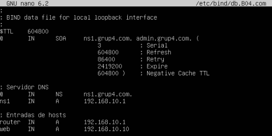
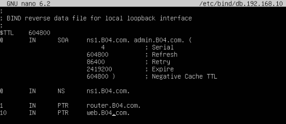
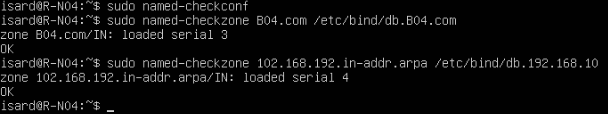
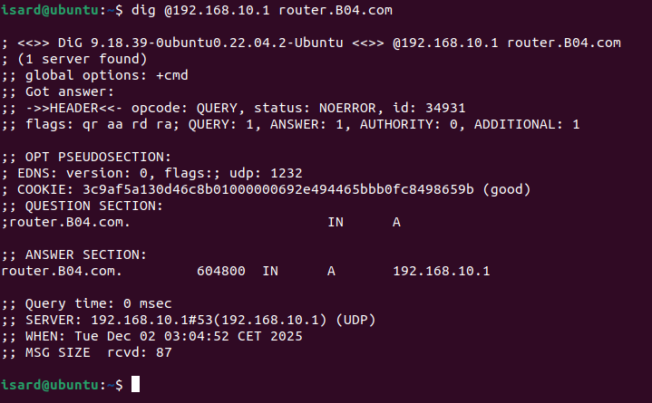
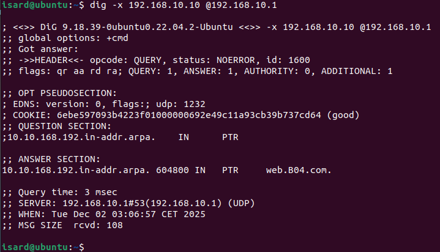

# Instalación y Configuración del DNS

```bash
sudo apt install bind9 bind9utils bin9-doc  -y
```

Definimos los forwarders externos
```bash
sudo nano /etc/bind/named.conf.local
```
```bash
        forwarders {
        8.8.8.8;
        8.8.4.4;
        };
        listen-on { 127.0.0.1; 192.168.10.1; };
        allow-query { any; };
        recursion yes;
```


Declaramos las zonas en /etc/bind/named.conf.local

```bash
zone "B04.com" IN {
        type master;
        file "/etc/bind/db.B04.com";
};

zone "10.168.192.in-addr.arpa" {
        type master;
        file "/etc/bind/db.192.168.10";
};
```


Copiaremos el archivo db.local y le pondremos el nombre db.ncc.local para luego modificarlo
```bash
sudo cp /etc/bind/db.local /etc/bind/db.B04.com
```
```bash
sudo nano /etc/bind/db.B04.com
```
Lo modificaremos de esta forma
```bash
$TTL    604800
@       IN      SOA     ns1.grup4.com. admin.grup4.com. (
                            3           ; Serial
                            604800      ; Refresh
                            86400       ; Retry
                            2419200     ; Expire
                            604800 )    ; Negative Cache TTL

; Servidor DNS
@       IN      NS      ns1.grup4.com.
ns1     IN      A       192.168.10.1

; Entradas de hosts
router  IN      A       192.168.10.1
web     IN      A       192.168.10.10
```


Ahora haremos lo mismo pero para la zona inversa
```bash
sudo cp /etc/bind/db.127 /etc/bind/db.192.168.10
```
```bash
sudo nano /etc/bind/db.192.168.10
```
```bash
$TTL    604800
@       IN      SOA     ns1.B04.com. admin.B04.com. (
                            4           ; Serial
                        604800          ; Refresh
                        86400           ; Retry
                        2419200         ; Expire
                        604800 )        ; Negative Cache TTL

@       IN      NS      ns1.B04.com.

1       IN      PTR     router.B04.com.
10      IN      PTR     web.B04.com.
```


Aplicamos las modificaciones hechas
```bash
sudo named-checkconf
sudo named-checkzone B04.com /etc/bind/db.B04.com
sudo named-checkzone 10.168.192.in-addr.arpa /etc/bind/db.192.168.10
```


Para terminar todo el proceso de socnfiguración y poder aplicar los cambios reinciaremos el servicio
```bash
sudo systemctl restart bind9
```

Comprobamos que funcione correctamente con un cliente Ubuntu

```bash
dig @192.168.10.1 router.B04.com
```


```bash
dig @192.168.10.1 web.B04.com
```


```bash
dig -x 192.168.10.10 @192.168.10.1
```



---
<div align="left"><a href="./comandos_DHCP.md">Página anterior</a></div>
<div align="right"><a href="./comandos_ftp.md">Siguiente página</a></div>
