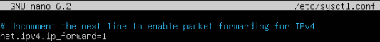
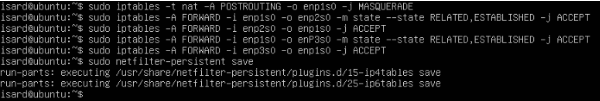

# Router

Configuramos el netplan del servidor que hara la función de router de esta manera

```bash
network:
  version: 2
  renderer: networkd
  ethernets:
    enp1s0:                      # WAN
      dhcp4: true
    enp2s0:                      # Red Servidores
      dhcp4: false
      addresses:
        - 192.168.10.1/24
    enp3s0:                      # Red Clientes
      dhcp4: false
      addresses:
        - 192.168.100.1/24
```
Aplicamos los cambios
```bash
sudo netplan apply
```

Modificamos el archivo sysctl.conf para el renvio de paquetes

```bash
sudo nano /etc/sysctl.conf
```
Descomentamos net.ipv4.ip_forward=1


Para poder aplicar los cambios
```bash
sudo sysctl -p
```

Instalamos el iptables-persistent
```bash
sudo apt install iptables-persistent
```
```bash
sudo iptables -t nat -A POSTROUTING -o enp1s0 -j MASQUERADE
sudo iptables -A FORWARD -i enp1s0 -o enp2s0 -m state --state RELATED,ESTABLISHED -j ACCEPT
sudo iptables -A FORWARD -i enp2s0 -o enp1s0 -j ACCEPT
sudo iptables -A FORWARD -i enp1s0 -o enp3s0 -m state --state RELATED,ESTABLISHED -j ACCEPT
sudo iptables -A FORWARD -i enp3s0 -o enp1s0 -j ACCEPT
```


Para guardar los cambios
```bash
sudo netfilter-persistent save
```
---
<div align="left"><a href="./comandos_ftp.md">Página anterior</a></div>
<div align="right"><a href="./comandos_apache.md">Siguiente página</a></div>
